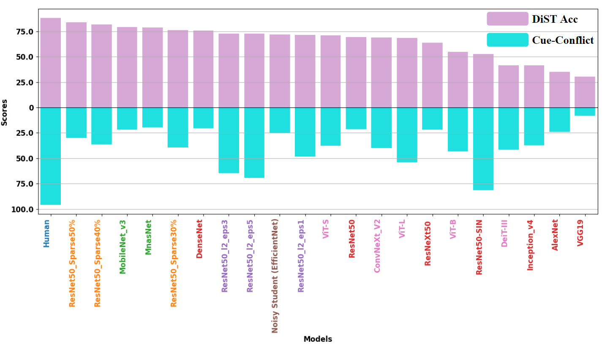

# Does resistance to style-transfer equal Global Shape Bias? Measuring network sensitivity to global shape configuration

The repo serves as supporting material of paper *Does resistance to style-transfer equal Global Shape Bias? Measuring network sensitivity to global shape configuration*. The repo has been anonymized to abid the double-blind review process.

The following is the structure of this repo.
```
├── data/                    # Images of DiST
    ├── original/            # Stored the original images
    ├── set1/                # Stored the structure disruppted images
    ├── set2/                # Stored the another version of structure disruppted images
├── src/                     # Source code 
    ├── feature_attribution/ # Source code for generate the sensitivity map
├── model/                   # Model weight trained by applying DiSTinguish using ffcv
├── scirpts/                 # Utility scripts
├── plot/                    # Plot of tSNE visuzalization
└── README.md                # This README file
```


## Evaluate shape bias based on Disruppted Structure  TestBench (DiST)

`/src/eval.py` contains the code that is used for the evaluation using DiST. To reproduce the results in the paper, execute `/scripts/eval.sh`. 

You can also add your model by changing the code in `/src/eval.py`. Notice that since DiST evaluate the similarity of the representation, you should **remove the classification header** to let the model directly return the feature vector.



`/scripts/eval.sh` would also generate the tNSE result and save it in `/plot`


## Feature Attribution Analysis 
We use saliency map (sensitivity map) to do the Feature Attribution Analysis. The program used to generate the saliency map result come from https://github.com/idiap/fullgrad-saliency. 

To reproduce the results in the paper, execute `/scripts/sensitivity.sh`. The result will be saved in `/src/feature_attribution/result`. Notice that is would produce the saliency maps with binary mask, to produce the orignal saliency maps, set `--binary` to 0.


